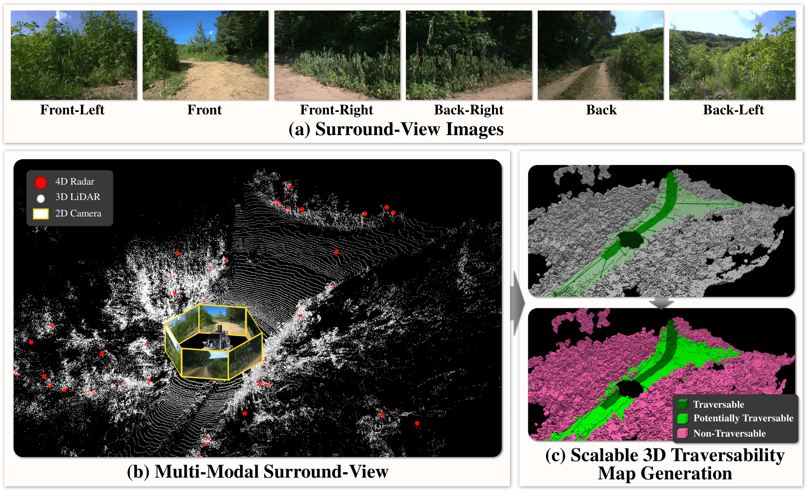

# 🌄🚗 STONE Dataset
### A Scalable Multi-Modal Surround-View 3D Traversability Dataset  
### for Off-Road Robot Navigation

 

<b>📷 Example Scenes from the STONE Dataset</b>

 

## 📢 Updates

- **[2024-10]** The Google Form link for download has been changed. [Google Form](#)
- **[2024-06]** The final dataset is released! Download it via the link at the end of the Google Form. [Google Form](#)
- **[2023-09]** Our paper is accepted to NeurIPS 2023 Dataset and Benchmark Track! [Paper Link](#)
